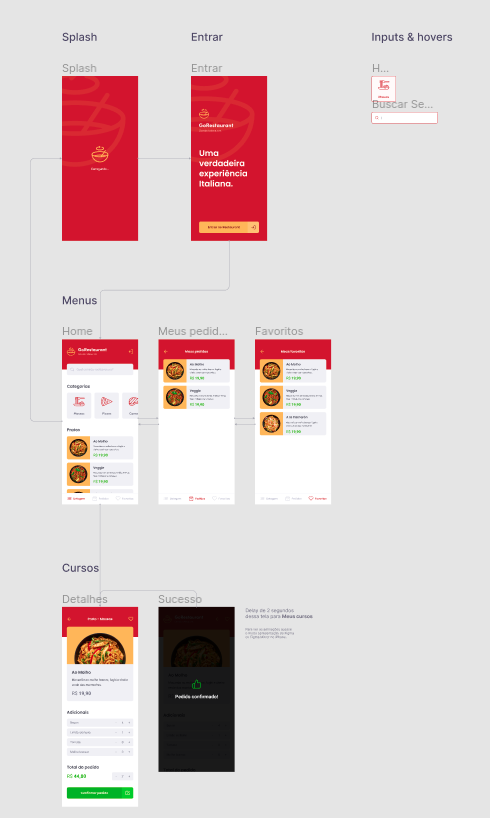

<h1 align="center">Desafio 11: GoRestaurant Mobile</h1>
<p align="center">
  
</p>


<p align="center">
  

  <a href="license.md">
  
  </a>
</p>

___

<h3 align="center">
  <a href="#information_source-sobre">Sobre</a>&nbsp;|&nbsp;
  <a href="#rocket-tecnologias-frameworks-dependencias">Tecnologias</a>&nbsp;|&nbsp;
  <a href="#licença">Licença</a>
</h3>

___

<br>

## :information_source: Sobre

<br>

Desenvolvimento de uma aplicação, a GoRestaurant, na versão mobile para o cliente.

Essa será uma aplicação que irá se conectar a uma Fake API, e exibir e filtrar os pratos de comida da API e permitir a criação de novos pedidos.

<br>

## 📌 Utilizando uma fake API

<br>

Para que se tenha os dados para exibir em tela, foi criado um arquivo que poderá ser utilizado como fake API para prover esses dados.

No `package.json` tem uma dependência chamada `json-server`, e um arquivo chamado `server.json` que contém as seguintes rotas:

- `/foods`: Retorna todas as comidas cadastradas na API

- `/foods/:id`: Retorna um prato de comida cadastradas na API baseado no `id`

- `/categories`: Retorna todas as categorias cadastradas na API

- `/orders`: Retorna todas os pedidos que foram cadastrados na API

- `/favorites`: Retorna todas as comidas favoritas que foram cadastrados na API

```js
  yarn json-server server.json -p 3333
```

<br>

## 📌 Layout da aplicação

<p align="center">
  
</p>

<br>

## 📌 Funcionalidades da aplicação

- **`Listar os pratos de comida da sua API`**: Sua página `Dashboard` deve ser capaz de exibir uma listagem, com o campo `name`, `value` e  `description` de todos os pratos de comida que estão cadastrados na sua API.

- **`Listar as categorias da sua API`**: Sua página `Dashboard` deve ser capaz de exibir uma listagem, com o campo `title` e `image_url` de todas as categorias que estão cadastrados na sua API.

**Dica**: O campo thumbnail_url será utilizada como imagem da categoria, deixamos três categorias como exemplo no arquivo server.json.

- **`Filtrar pratos de comida por busca ou por categorias`**: Em sua página Dashboard permitir que o input de pesquisa e os botões de categoria façam uma busca na API de acordo com o que estiver selecionado ou escrito no input.

- **`Listar os pedidos da sua API`**: Sua página `Orders` deve ser capaz de exibir uma listagem, com o campo as informações do produto pedido, com `name` e `description` de todos os pedidos que estão cadastrados na sua API.

**Dica**: Por se tratar de uma Fake API e de não possuir usuários, não será necessário cadastrar o campo `user_id`, considere que deve ser listados todos os pedidos da API como se fossem os seus pedidos.

- **`Listar os pratos favoritos da sua API`**: Sua página `Favorites` deve ser capaz de exibir uma listagem, com o campo as informações do produto favorito, com `name` e `description` de todos os pedidos que estão cadastrados na sua API.

**Dica**: Por se tratar de uma Fake API e de não possuir usuários, não será necessário cadastrar o campo `user_id`, considere que deve ser listados todos os favoritos da API como se fossem os seus favoritos.

- **`Realizar um pedido`**: Na sua página `Dashboard`, ao clicar em um item, você deve redirecionar o usuário para a página `FoodDetails`, onde será possível realizar um novo pedido, podendo controlar a quantidade desse item pedido, ou adicionar ingredientes extras. Todo o valor deve ser calculado de acordo com a quantidade pedida.

**Dica**: Você pode usar o método `reduce` para somar o valor de todos os extras pedidos e somá-lo com o valor do prato de comida. Depois disso lembre-se de multiplicar tudo pela quantidade pedida do produto.

## 📌 Específicação dos testes

Para esse desafio, temos os seguintes testes:

- **`should be able to list the food plates`**: Para que esse teste passe, sua aplicação deve permitir que sejam listados na sua `Dashboard`, todos os pratos de comidas que são retornados da sua fake API.

- **`should be able to list the food plates filtered by category`**: Para que esse teste passe, sua aplicação deve permitir que sejam listados na sua `Dashboard`, os pratos de comidas filtrados por categoria da sua fake API.

<br>

**Dica**: No json-server você pode usar os query params normalmente para buscar/filtrar de acordo com o valor de um campo do item no arquivo server.json. Por exemplo, para filtrar todos os pratos com a categoria 1, a sua url ficaria como `http://localhost:3000/foods?category_like=1`.

<br>

- **`should be able to list the food plates filtered by name search`**:  Para que esse teste passe, sua aplicação deve permitir que sejam listados na sua `Dashboard`, os pratos de comidas filtrados por nome da sua fake API.

<br>

**Dica**: No json-server você pode usar os query params normalmente para buscar/filtrar de acordo com o valor de um campo do item no arquivo server.json. Por exemplo, para filtrar todos os pratos com o nome Veggie, a sua url ficaria como `http://localhost:3000/foods?name_like=Veggie`.

<br>

- **`should be able to navigate to the food details page`**: Para que esse teste passe, em sua `Dashboard`, você deve permitir que ao clicar em um item, seja navegado para a página `FoodDetails` passando por parâmetro da navegação o id do item clicado.

- **`should be able to list the favorite food plates`**: Para que esse teste passe, sua aplicação deve permitir que sejam listados na sua página `Favorites`, todos os pratos de comidas que estão salvos na rota `favorites`.

- **`should be able to list the orders`**: Para que esse teste passe, sua aplicação deve permitir que sejam listados na sua página `Orders`, todos os pratos de comidas que estão salvos na rota `orders`.

- **`should be able to list the food`**: Para que esse teste passe, sua aplicação deve permitir que seja listado todos os dados de uma comída específica na página `FoodDetails`, baseado no id recuperado pelos parametros da rota.

<br>

**Dica 1**: Use o hook `useRoute` para pegar o atributo `params` que conterá o id enviado por parametro.

<br>

**Dica 2**: Com o id recuperado por parametro da navegação, faça uma busca na sua API com os dados atualizados da food na roda `/foods/:id`.

<br>

- **`should be able to increment food quantity`**: Para que esse teste passe, você deve permitir que seja incrementada em 1 a quantidade do item na página `FoodDetails`.

- **`should be able to decrement food quantity`**: Para que esse teste passe, você deve permitir que seja decrementada em 1 a quantidade do item na página `FoodDetails`.

<br>

**Dica**: Não permita que o valor do input seja alterado para menor que 1, para que assim o pedido sempre tenha no mínimo um item.

<br>

- **`should not be able to decrement food quantity below than 1`**: Para que esse teste passe, você deve impedir que seja decrementado a quantidade de itens até um número menor que 1, assim o número mínimo de itens no pedido é 1.

- **`should be able to increment an extra item quantity`**: Para que esse teste passe, você deve permitir que seja incrementada em 1 a quantidade de um ingrediente extra na página `FoodDetails` baseado no seu id.

- **`should be able to decrement an extra item quantity`**: Para que esse teste passe, você deve permitir que seja decrementado em 1 a quantidade de um ingrediente extra na página `FoodDetails` baseado no seu id.

<br>


## 📌 Expandindo os horizontes

Essa é uma aplicação totalmente escalável, isso significa que além das específicações, após finalizado o desafio, é totalmente possível implementar mais funcionalidades a essa aplicação, e essa será uma ótima maneira para fixar os conhecimentos.

Poderão ser implementadas desde funcionalidades simples que não foram específicadas nos testes, como a finalização completa de um pedido, ou uma página que irá mostrar dados do pedido realizado.

Por exemplo, implementação de uma página contendo o número de itens e os ingredientes extras que foram adicionados à um pedido, essa página será aberta a partir da tela `Orders` ao clicar em algum pedido.

<br>

## 🚀 Tecnologias, Frameworks e Dependências

- [ReactJs](https://pt-br.reactjs.org/)
- [TypeScript](https://www.typescriptlang.org/)
- [React Native](https://reactnative.dev/)
- [React Navigation](https://reactnavigation.org/docs/getting-started/)
- [Styled-components](https://styled-components.com/)
- [Unform](https://www.npmjs.com/package/@rocketseat/unform)
- [Yup](https://www.npmjs.com/package/yup)
- [Axios](https://github.com/axios/axios)
- [Json-server](https://www.npmjs.com/package/json-server)

<br>

## Licença

Esse projeto está sob a licença MIT. Veja o arquivo [LICENSE](LICENSE) para mais detalhes.
